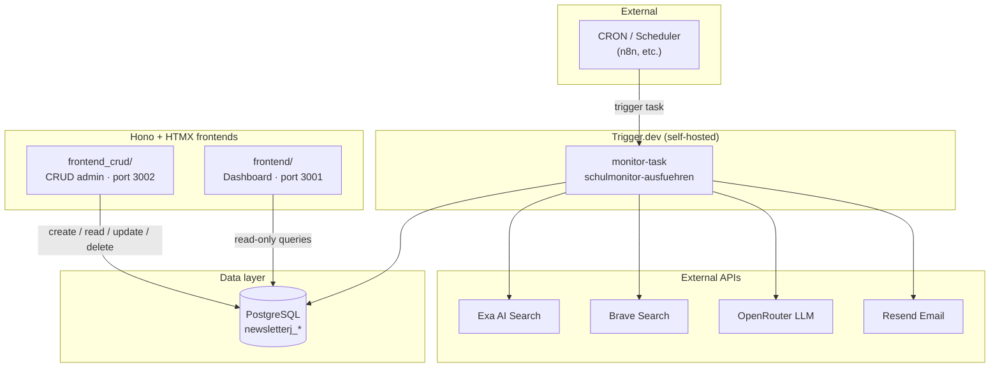
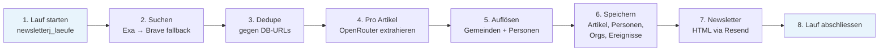
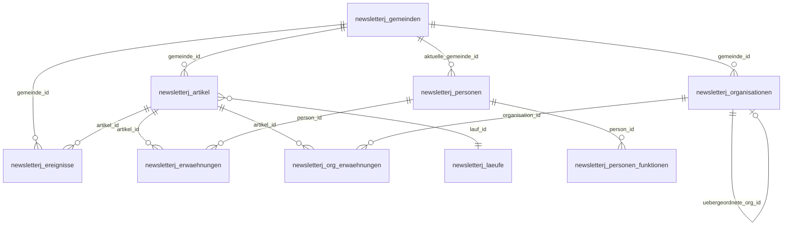
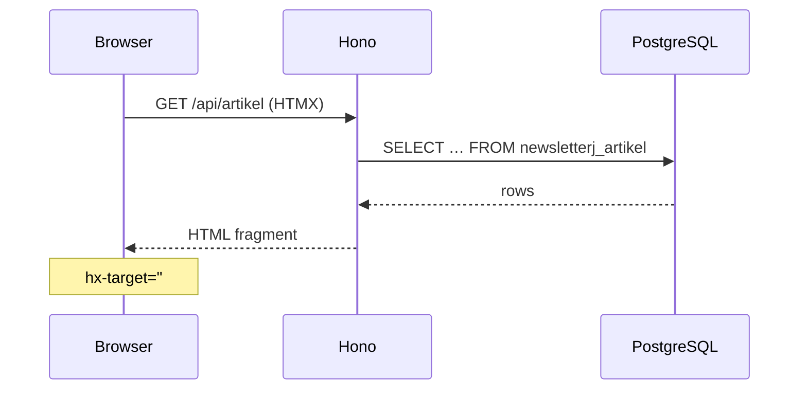

# newsletterj — Schulmonitor ZH

Investigative media monitoring for **education policy, public schools, and public administration** in Canton Zurich, Switzerland.

The system has three cooperating parts:

| Part | Role | Technology |
|------|------|------------|
| **Brain** | Automated monitoring, AI extraction, newsletter | Trigger.dev task + Node.js |
| **Database** | Single source of truth for all entities | PostgreSQL (`newsletterj_*` tables) |
| **Frontends** | Human-facing UIs on top of the same DB | Hono + HTMX |

There is no built-in cron inside this repo. An **external scheduler** (e.g. n8n, systemd timer, or another service) calls the Trigger.dev API on a schedule to start a monitor run.

---

## System overview



**Data flow in one sentence:** the scheduler wakes the brain → the brain searches media, enriches articles with AI, writes structured records to Postgres, and emails a newsletter → the frontends read (or edit) that same database.

---

## The brain — Trigger.dev monitor task

Task ID: `schulmonitor-ausfuehren`  
Source: `src/trigger/monitor-task.ts`

Each run is a long-lived job (up to 2 hours) that orchestrates the full pipeline:



### What happens per article

1. **Search** — 15 predefined queries (`src/config/suchanfragen.ts`) run against Swiss media domains (`src/config/quellen.ts`). Exa is primary; Brave supplements when Exa returns fewer than 3 hits.
2. **Deduplication** — URLs are normalized (tracking params stripped) and skipped if already in `newsletterj_artikel`.
3. **Extraction** — Title + Exa summary go to OpenRouter. The model returns categories, relevance, municipalities, persons, organisations, and events.
4. **Entity resolution** — AI-assisted merge for persons and municipalities against existing records.
5. **Persistence** — All structured data lands in Postgres via `src/lib/db.ts`.
6. **Newsletter** — Processed (and failed) articles are compiled into an HTML email and sent through Resend.

Per-article errors are logged and collected; one failure does not abort the whole run.

For billing, API details, and column-level mapping, see [`tech_explanation.md`](tech_explanation.md).

### Deploy & trigger

```bash
# From repo root
npm install
npm run deploy   # Trigger.dev CLI → self-hosted instance
```

Environment variables live in `src/.env` (see [Configuration](#configuration)).

To trigger manually, use the Trigger.dev dashboard or API against your self-hosted instance. The project is configured for profile `wineagent` and API URL `https://triggerdev.wineagent.ch` (see `package.json` scripts).

---

## The database — PostgreSQL

All application components share one `DATABASE_URL`. Tables use the prefix `newsletterj_`.



| Table | Purpose |
|-------|---------|
| `newsletterj_gemeinden` | Canonical municipalities + aliases |
| `newsletterj_artikel` | Media articles found by search |
| `newsletterj_personen` | Merged person profiles |
| `newsletterj_personen_funktionen` | Role history per person |
| `newsletterj_erwaehnungen` | Person ↔ article links |
| `newsletterj_organisationen` | Schools, authorities, committees |
| `newsletterj_org_erwaehnungen` | Organisation ↔ article links |
| `newsletterj_ereignisse` | Extracted events (conflicts, elections, etc.) |
| `newsletterj_laeufe` | Monitor run log |

Full DDL is documented in [`CLAUDE.md`](CLAUDE.md#database-schema).

---

## The frontends — Hono + HTMX

Both frontends are lightweight Node servers: **no React, no SPA build step**. Static HTML shells load fragments via HTMX `hx-get` into a main content area. Server routes return HTML partials; Postgres is queried with `postgres.js` tagged templates.



### Dashboard — `frontend/` (port 3001)

**Purpose:** Read-only analytics and browsing — trends, filters, detail views.

| Route prefix | View |
|--------------|------|
| `/api/dashboard` | Overview stats |
| `/api/artikel` | Article list + detail |
| `/api/personen` | Person profiles |
| `/api/ereignisse` | Event timeline |
| `/api/gemeinden` | Per-municipality activity |
| `/api/laeufe` | Monitor run history |

Auth: session cookie after login (`admin` / `FRONTEND_PW`).

```bash
cd frontend
npm install
cp .env_example .env   # DATABASE_URL, FRONTEND_PW, PORT
npm run dev              # http://localhost:3001
```

Production deploy: Docker + Traefik (`frontend/docker-compose.yml` → e.g. `media.ernilabs.com`).

### CRUD admin — `frontend_crud/` (port 3002)

**Purpose:** Direct create/read/update/delete on every `newsletterj_*` table — for corrections, manual data entry, and debugging.

| Route prefix | Access |
|--------------|--------|
| `/admin/:resource` | HTMX UI (list, forms, delete) |
| `/api/:resource` | JSON REST API (same CRUD) |

Resources are declared in `frontend_crud/src/config/resources.ts` (gemeinden, artikel, personen, erwaehnungen, organisationen, ereignisse, laeufe, …).

Auth: HTTP Basic (`admin` / `FRONTEND_PW`).

```bash
cd frontend_crud
npm install
# create .env with DATABASE_URL, FRONTEND_PW, PORT=3002
npm run dev              # http://localhost:3002
```

Example REST call:

```bash
curl -u admin:YOUR_PW http://localhost:3002/api/gemeinden
```

---

## Repository layout

```
newsletterj/
├── src/
│   ├── trigger/
│   │   └── monitor-task.ts      # Trigger.dev orchestrator ("the brain")
│   ├── lib/
│   │   ├── db.ts                # All Postgres writes from the pipeline
│   │   ├── suche.ts             # Exa + Brave search orchestration
│   │   ├── extraktion.ts        # OpenRouter article extraction
│   │   ├── personen.ts          # Person + municipality AI merge
│   │   └── email.ts             # Newsletter HTML + Resend
│   └── config/
│       ├── quellen.ts           # Media source domains
│       ├── suchanfragen.ts      # Search query templates
│       └── kategorien.ts        # Category enums
├── frontend/                    # Dashboard (read-only HTMX UI)
├── frontend_crud/               # CRUD admin (HTMX + REST)
├── trigger.config.ts
├── package.json                 # Trigger.dev backend
├── CLAUDE.md                    # Full schema + API reference
└── tech_explanation.md          # Pipeline & billing deep-dive
```

---

## Configuration

### Monitor task (`src/.env`)

| Variable | Used for |
|----------|----------|
| `DATABASE_URL` | PostgreSQL connection |
| `EXA_API_KEY` | Primary search |
| `BRAVE_API_KEY` | Search fallback |
| `OPENROUTER_API_KEY` | Extraction + entity merge |
| `OPENROUTER_MODEL` | e.g. `google/gemini-2.5-flash` |
| `RESEND_API_KEY` | Newsletter delivery |
| `NEWSLETTER_TO_EMAIL` | Comma-separated recipients |
| `NEWSLETTER_FROM_EMAIL` | Optional sender override |

### Frontends (`frontend/.env`, `frontend_crud/.env`)

| Variable | Used for |
|----------|----------|
| `DATABASE_URL` | Same Postgres instance |
| `FRONTEND_PW` | Login password |
| `PORT` | `3001` (dashboard) or `3002` (CRUD) |

---

## How the pieces fit together

```
┌─────────────────────────────────────────────────────────────────┐
│                     EXTERNAL CRON / SCHEDULER                    │
│         POST trigger → schulmonitor-ausfuehren (daily, etc.)   │
└───────────────────────────────┬─────────────────────────────────┘
                                │
                                ▼
┌─────────────────────────────────────────────────────────────────┐
│  TRIGGER.DEV TASK (brain)                                        │
│  Search → Extract → Resolve → Save → Email                       │
└───────────────────────────────┬─────────────────────────────────┘
                                │ writes
                                ▼
                    ┌───────────────────────┐
                    │      PostgreSQL       │
                    │   newsletterj_*       │
                    └───────────┬───────────┘
                                │ reads / edits
              ┌─────────────────┴─────────────────┐
              ▼                                   ▼
   ┌─────────────────────┐             ┌─────────────────────┐
   │  frontend/          │             │  frontend_crud/     │
   │  Dashboard          │             │  CRUD + REST API    │
   │  (browse & analyze) │             │  (manage records)   │
   └─────────────────────┘             └─────────────────────┘
```

- **Only the monitor task** calls external search/AI/email APIs and **creates** most data automatically.
- **Both frontends** talk to Postgres only — they never trigger searches or LLM calls.
- **CRUD** can fix AI mistakes, add missing gemeinden, or inspect raw `roh_json`; the next monitor run continues deduplicating by URL.

---

## Development commands

| Location | Command | Purpose |
|----------|---------|---------|
| Root | `npm run dev` | Local Trigger.dev worker |
| Root | `npm run deploy` | Deploy task to Trigger.dev |
| Root | `npm run typecheck` | TypeScript check (backend) |
| `frontend/` | `npm run dev` | Dashboard on :3001 |
| `frontend_crud/` | `npm run dev` | CRUD admin on :3002 |

---

## Further reading

- [`CLAUDE.md`](CLAUDE.md) — Domain model, full SQL schema, API reference, category list
- [`tech_explanation.md`](tech_explanation.md) — Exa vs OpenRouter billing, extraction fields, failure handling
